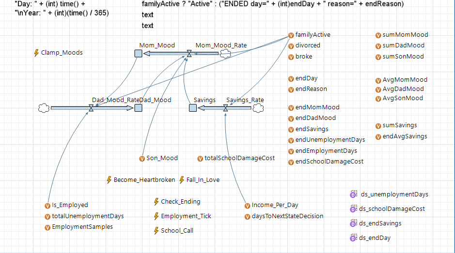

# Family Life Simulation – AnyLogic

Discrete-event simulation developed in **AnyLogic** for a university course on simulation and modeling.

## Overview

This project simulates the dynamics of a family consisting of a mother, father, and son over time.

The simulation models how employment, finances, and emotional states influence the long-term stability of the family.

## Model Overview

## Simulation Run

## Monte Carlo Experiment (100 iterations)

## Model Features

- stochastic employment and unemployment periods
- mood interactions between family members
- financial income and expenses
- probabilistic life events affecting family outcomes
- possible outcomes such as bankruptcy or divorce

## Technologies

- AnyLogic
- Discrete Event Simulation
- Stochastic modeling
